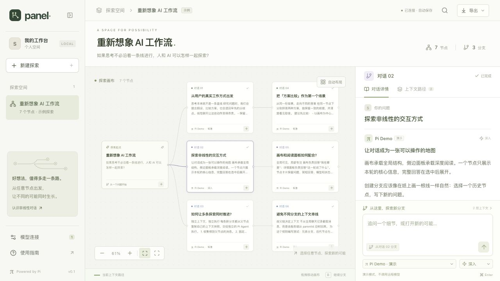

# Panel

基于 Pi 的非线性 Agent 工作台。对话是一张图，每轮对话是一个节点。

- 从上下文有效的已完成、失败或已停止节点创建分支，上下文只沿当前分支回溯到根。
- 多个分支同时运行，每轮可独立选择模型与思考强度。
- 支持对话附件与 `@` 引用卡片。
- 支持网页搜索、文件读写和命令执行，提供人工批准与安全模型审核。



## 快速启动

需要 Node.js ≥ 22.19 和 Git。

```bash
git clone --recurse-submodules https://github.com/H0ypothesis/panel.git
cd panel
npm ci --ignore-scripts
npm run setup:pi
npm run dev
```

打开 <http://127.0.0.1:4317>。没有 API Key 也可使用 Pi Demo 体验分支流程，演示模型返回预设内容。

使用真实模型时，复制 [.env.example](.env.example) 为 `.env`，填写所需密钥并重启服务，详见[模型配置](docs/CONFIGURATION.md)。

## 文档

- [使用指南](docs/USAGE.md)：分支、画布、附件、卡片引用、导入导出与上下文压缩。
- [模型配置](docs/CONFIGURATION.md)：供应商密钥、默认模型与思考设置。
- [工具与审批](docs/TOOLS.md)：本地编码、联网工具、审批与文件快照。
- [开发与运行](docs/DEVELOPMENT.md)：安装细节、数据目录、构建与验证。
- [macOS 客户端](docs/MACOS.md)：应用使用与打包。
- [产品需求](docs/PRD.md) · [首版验收记录](docs/VERIFICATION.md)。
