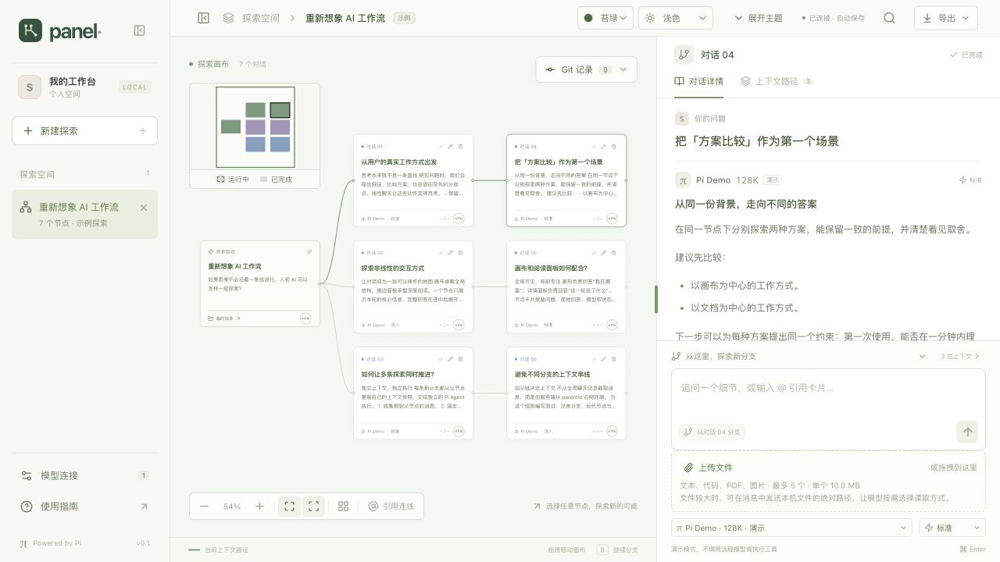

<p align="center">
  
</p>

<h1 align="center">Panel</h1>

<p align="center"><strong>让思考自由生长。</strong></p>
<p align="center">基于 Pi 的非线性 Agent 工作台，把对话变成一张可以分支、比较与融合的图。</p>

<!-- 发布新版时同步更新安装包链接。 -->
<p align="center">
  <a href="https://github.com/H0ypothesis/panel/releases/download/v0.9.7/Panel-mac-arm64.zip">
    
  </a>
</p>

<p align="center">
  <a href="https://github.com/H0ypothesis/panel/releases">所有版本</a> ·
  <a href="docs/USAGE.md">使用指南</a> ·
  <a href="docs/CONFIGURATION.md">模型配置</a> ·
  <a href="#从源码运行">从源码运行</a>
</p>

从同一个问题出发，沿不同方向继续追问，让多个模型并行探索，再把有价值的分支汇合。每轮对话保留自己的问题、回答与上下文路径，你可以随时回到之前的节点，继续一个新的想法。

<picture>
  <source media="(prefers-color-scheme: dark)" srcset="docs/assets/workbench-dark.png">
  <source media="(prefers-color-scheme: light)" srcset="docs/assets/workbench.png">
  
</picture>

<p align="center">当前版本实拍 · Pi Demo 示例探索 · <a href="docs/assets/workbench.png">浅色预览</a> / <a href="docs/assets/workbench-dark.png">深色预览</a></p>

## 用 Panel 做什么

| 能力               | 使用方式                                                                  |
| ------------------ | ------------------------------------------------------------------------- |
| **分支探索**       | 从历史节点继续追问，为不同假设和方案保留各自的对话路径。                  |
| **多模型并行**     | 每轮独立选择模型与思考强度，一个分支生成时继续探索其他方向。              |
| **子代理协作**     | 主模型自动委派，或用 `@` 选择 Subagents；在卡片头像和右侧子页查看各代理。 |
| **分支融合与引用** | 连接多条分支，汇总不同路径；输入 `@` 引用其他卡片的问答。                 |
| **看见上下文**     | 查看模型实际收到的路径、摘要与用量，按需手动或自动压缩长对话。            |
| **执行真实任务**   | 搜索网页、读取和修改文件、执行命令，支持人工批准或独立安全模型审核。      |
| **带着资料提问**   | 上传文本、代码、PDF 和图片；导出完整探索 JSON 或选中路径的 Markdown。     |

工作台提供 **苔绿、黑白、海蓝、鸢紫、暖砂** 五种配色，每种都支持浅色、深色和跟随系统。macOS 客户端与 Web 版使用相同的工作台，并提供原生菜单、文件夹选择器和融入界面的窗口标题栏。

## 下载与开始使用

1. 点击顶部下载按钮，解压 `Panel-mac-arm64.zip`，将 `Panel.app` 放入「应用程序」后打开。App 内置运行环境，无需另装 Node.js。
2. 先用 **Pi Demo** 体验分支流程，无需 API Key。演示内容为预设回复，不调用真实模型或执行工具。
3. 使用真实模型时，打开左下角 **「模型连接」→「未配置」**，填写 **API URL、API Key、Model** 并保存，配置立即生效。
4. 新建探索，写下主题与背景；点击卡片右侧的 **`+`** 开始提问，或选中历史节点继续分支。

当前公开下载版本为 **v0.9.7**，安装包面向 **Apple Silicon（arm64），macOS 13.5 及以上**。这是采用本地 ad-hoc 签名的预览版，尚未完成 Apple 公证；Intel 版本暂未提供下载。安装与快捷键说明见 [macOS 客户端文档](docs/MACOS.md)。

按住顶部空白区域可拖动窗口，双击可放大到可用桌面区域，再次双击恢复原尺寸。模型配置也可通过 `⌘,` 打开。

**v0.5 起支持 App 内更新**：每天自动检查 GitHub Release，发现新版后在左下角版本号旁显示「有更新」。点击即可下载、校验、替换并重启，探索和 API 配置会保留；有运行任务时需先等待完成。也可使用「Panel → 检查更新…」手动检查。

v0.9.7 将思考强度和 effort 选择改为浮层卡片与滑杆，可拖动选择档位、查看说明，支持键盘调整和 Esc 关闭；max 档位增加像素动效，并适配深浅主题及减少动态效果设置。安装包已通过 v0.9.1 与 v0.9.6 更新器的完整解压和签名校验。

v0.9.6 新增交付文件入口，明确交付的成果可查看、预览和下载；Mac 客户端支持使用默认应用打开，以及在 Finder 中定位。新建分支使用探索保存的默认模型和思考设置。安装包已通过 v0.9.1 与 v0.9.5 更新器的完整解压和签名校验。详见 [交付文件](docs/USAGE.md#交付文件)。

v0.9.5 新增电脑操作实时预览，Mac 客户端通过置顶画中画显示当前目标，支持移动、缩放、刷新及停止任务。模型思考开关与 effort 档位可独立设置，并提供参数兼容性检测；新建探索时可选择默认模型、思考设置和审批方式。使用说明见 [macOS 客户端](docs/MACOS.md#电脑操作实时预览) 和 [模型配置](docs/CONFIGURATION.md)。

v0.9.1 修复 macOS 顶部拖动窗口时的抖动问题，保留双击放大至屏幕可用区域及还原的行为。

v0.9 新增系统编码沙盒，主代理和 Pi 子代理的命令写入限于当前项目及私有临时目录，联网目标单独审批；初始化异常可重试或人工批准单次宿主执行。模型临时断线最多自动重连 5 次，保留已完成工具结果，并改进子代理等待、超时、运行记录与审批界面。规则和边界见 [编码沙盒](docs/SANDBOX.md)。

同时保留运行中追加消息、原生子代理后台与嵌套执行、审批和完成后汇总；使用电脑控制或子代理时会自动开启长程模式。

## 从源码运行

需要 **Node.js ≥ 22.19** 和 **Git**。

```bash
git clone --recurse-submodules https://github.com/H0ypothesis/panel.git
cd panel
npm ci --ignore-scripts
npm run setup:pi
npm run dev
```

打开 <http://127.0.0.1:4317>。如果克隆时遗漏了子模块，先运行 `git submodule update --init --recursive`。依赖安装需要联网；`setup:pi` 从固定版本的官方 npm 包离线安装并校验模型目录，不访问 Vercel。

常用开发命令：

```bash
npm run check       # 前后端 TypeScript 检查
npm run test:core   # 核心逻辑测试
npm run build       # 构建 Web 前端
npm start           # 启动生产模式本地服务
```

前端使用 React、TypeScript 与 React Flow，后端使用 Node.js 和 Pi；Mac 外壳使用 Swift、AppKit 与 WKWebView。开发环境、验证流程见 [开发与运行](docs/DEVELOPMENT.md)，App 打包步骤见 [从源码构建 macOS 客户端](docs/MACOS.md#从源码构建)。

## 数据与运行方式

Panel 面向本地单用户使用，服务仅监听本机地址。探索记录、附件和配置保存在本地；调用模型或联网工具时，会把相关内容发送到你配置的服务。

| 运行方式          | 默认数据位置                            |
| ----------------- | --------------------------------------- |
| macOS App         | `~/Library/Application Support/Panel/`  |
| 源码启动的 Web 版 | 项目下的 `.panel/`，环境配置位于 `.env` |

两种运行方式使用独立的数据目录，可通过 JSON 导出和导入迁移探索。模型密钥不随探索导出。

分支各自管理对话上下文，但共享所选工作目录中的文件。命令在本机执行，停止任务不会撤销已经发生的文件修改；文件快照功能依赖本机 Git。具体规则见 [工具与审批](docs/TOOLS.md)。

## 文档

| 文档                                 | 内容                                                     |
| ------------------------------------ | -------------------------------------------------------- |
| [使用指南](docs/USAGE.md)            | 探索画布、分支融合、卡片引用、附件、上下文压缩与导入导出 |
| [模型配置](docs/CONFIGURATION.md)    | API URL、密钥、模型与思考设置                            |
| [工具与审批](docs/TOOLS.md)          | 本地编码、联网工具、审批与 Git 文件快照                  |
| [编码沙盒](docs/SANDBOX.md)          | 文件保护、联网目标授权与初始化恢复                       |
| [macOS 客户端](docs/MACOS.md)        | 安装、快捷键、数据目录与 App 打包                        |
| [开发与运行](docs/DEVELOPMENT.md)    | 依赖安装、项目结构、构建与验证                           |
| [产品需求](docs/PRD.md)              | 产品设计与功能边界                                       |
| [首版验收记录](docs/VERIFICATION.md) | 初始版本的验证范围与结果                                 |
